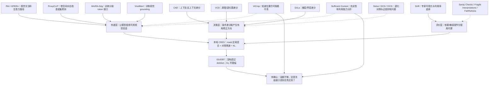

# 从 CRES 负结果到单一可证伪问题：证据无用，还是接口没有传递有用信息？

调研日期：2026-09-16。起点：`02c9397852e876b2a6aaba2f1a2f9f8c60d8b2e6`。
阶段：第一轮文献与代码审计；研究问题尚待用户确认，不是已完成的新算法。

## 摘要

CRES 的四小时截断实验中，真实空间与错位空间的收益接近，CRES 没有超过删除分割文字。
这支持否定当前接口的增量收益主张，却不足以断言分割证据没有医学价值。本报告按
“证据获取—信息传递—决策使用—正确性评价”建立文献关系图，区分论文明确结论与我们
重构的隐含假设。检索发现：扰动不等于正确性、定位不等于识别、上下文充足不等于被
利用，都已有重要先例；把这些结论改称新 Gate 并不构成创新。当前最值得先确认的问题
是：当同一份专家信息能够支持问题时，冻结的接口是否保留了任务所需的区别？代码审计
进一步发现本地空间算子是区域内视觉特征的凸混合，而不是专家语义的原生注入。该结构
给出了一个可检验的传递瓶颈，但还不是已证明的失败原因。本文不根据测试成绩调阈值，
不恢复已停止任务，也不把拟议实验写成已执行结果。

## 1. 研究问题与 Bit Flip 的边界

Stanford CS197 要求从相关工作中明确一个共享假设，说明其反转、具体实例与评价；
并非把任何反直觉句子或新模块叫创新。[课程原始讲义](https://hci.stanford.edu/courses/cs197/slides/03-arguing-a-project.pdf)
也提醒一个项目应集中表达一个主要新想法。本报告不把“所有文献都相信 X”作为未经验证的前提。

- RQ1：哪些方法把什么可观察量当成证据使用的代理？这些代理需要哪些成立条件？
- RQ2：`02c9397` 排除了哪些解释，又没有区分哪些解释？
- RQ3：哪一个最小的、正负结果都有解释价值的问题应先进入下一轮？

## 2. 检索方法与证据边界

使用三路独立检索：解码与前沿反例、空间/医学接口、解释与测量方法；主线另外核对
CS197、ProxyCLIP、本地代码及结果。检索覆盖经典方法、近期工作、机制、失败、评价、
相邻理论与官方代码。关键词包括 visual contrastive decoding limitations、medical
segmentation VLM、sufficient context、faithfulness sensitivity、visual detail cropping。
核验采用标题/作者/会议信息与原始摘要/全文两步，来源为 ACL/CVF/ICLR/PMLR、作者
arXiv 与官方仓库。不是统计意义上穷尽的 systematic review；未来还需围绕确认的问题
做第二轮精确机制碰撞检索。预印本不升级为顶会录用，代码存在不等于本地复现成功。

## 3. 关系图：按作用位置而非方法名字组织

实线表示机制上的支持/延伸关系，虚线表示质疑或适用边界；不是声称论文互相引用。
图中“假设”是本次分析重构，不一定是作者原话。



### 3.1 条件分布的差异何时是有用方向？

CAD [1] 与 VCD [2] 都放大条件分支差异，但前者处理外部文本与参数知识的冲突，后者
处理视觉退化与语言先验；DoLa [3] 的对照来自网络层，而非外部专家。它们不能统一被
描述为“专家置信度方法”。共同的操作性条件是分支差异中存在任务有用的方向，不是
“任何大的差异都正确”。[1](https://aclanthology.org/2024.naacl-short.69/)
[2](https://openaccess.thecvf.com/content/CVPR2024/html/Leng_Mitigating_Object_Hallucinations_in_Large_Vision-Language_Models_through_Visual_Contrastive_CVPR_2024_paper.html)
[3](https://proceedings.iclr.cc/paper_files/paper/2024/hash/edc36117f795ca52a0cbf6a7b3882859-Abstract-Conference.html)

Delve [4] 研究改变视觉内容后的不同解码行为；DCD [5] 质疑手工退化是否模拟真实幻觉，
但使用训练后的正负投影；CICD [6] 则讨论对比信号失真和过度抑制。这意味着“改用
更合理的对照图”已经是活跃方向，不足以成为我们的独立 Bit Flip。
[4](https://arxiv.org/abs/2412.06775)
[5](https://arxiv.org/abs/2504.08809)
[6](https://arxiv.org/abs/2505.10634)

官方 VCD 的 `vcd_utils/vcd_sample.py` 对两个分支分别 forward 和更新生成状态；
其 plausibility mask 依据原始 logits 限制候选。双分支不要求每步从头 replay，
也不能把被原始候选限制排除的 token 靠差分重新救回。CRES 没有同一个 plausibility
mask，不能把 VCD 的全部解释原封不动移植过来。
[代码](https://github.com/DAMO-NLP-SG/VCD/blob/master/vcd_utils/vcd_sample.py)

### 3.2 视觉信息存在，是否等于冻结模型能读懂？

PAI [7] 与 OPERA [8] 处理视觉关注/注意力路径问题，ViCrop [9] 则显示定位相关位置
不等于识别细节。三者共同提示“使用失败”可能发生在不同阶段；单一输出 KL 无法
识别是细节丢失、注意力路径受阻还是后续决策偏置。
[7](https://arxiv.org/abs/2407.21771)
[8](https://openaccess.thecvf.com/content/CVPR2024/papers/Huang_OPERA_Alleviating_Hallucination_in_Multi-Modal_Large_Language_Models_via_Over-Trust_CVPR_2024_paper.pdf)
[9](https://arxiv.org/abs/2502.17422)

ProxyCLIP [10] 将空间对应用于开放词汇分割，不证明任意冻结生成式 VLM 接口都有效；
MAIRA-Seg [11] 与 VividMed [12] 的医学收益则建立在训练接口/模型的条件下。因此
“医学分割本身有价值”与“现有 LLaVA-Med 不经训练能使用我们的凸混合”是不同主张。
纯裁剪、mask pooling、再加 grounding 模块都已有近邻，必须定位新的边界而非改名字。
[10](https://www.ecva.net/papers/eccv_2024/papers_ECCV/papers/08490.pdf)
[11](https://proceedings.mlr.press/v259/sharma25a.html)
[12](https://aclanthology.org/2025.naacl-long.89/)

### 3.3 依赖证据与得出正确答案之间缺少哪一步？

DnR [13] 用问题条件下的视觉利用率选择专家引导，而 Sufficient Context [14] 明确
分开证据是否充足与模型是否成功使用。它们启发测量不同环节，不能被拼成“高利用率
就是高正确率”的结论。Semantic Entropy [15] 衡量回答含义的不确定性，其核心目标
是 confabulations，也不是任意稳定错误的正确性检验器。
[13](https://arxiv.org/abs/2511.11005)
[14](https://proceedings.iclr.cc/paper_files/paper/2025/hash/33dffa2e3d2ab74a783d1a8c292f66d9-Abstract-Conference.html)
[15](https://www.nature.com/articles/s41586-024-07421-0)

Sanity Checks [16]、Fragile Interpretations [17] 与 Faithfulness [18] 分别警示可视化、
解释敏感性和忠实性评价的边界。“几何变了但标签没变”不是本轮新发现；我们必须把
表示变化、同前缀决策变化、整句变化、冻结评分变化分别统计。
[16](https://proceedings.neurips.cc/paper/2018/hash/294a8ed24b1ad22ec2e7efea049b8737-Abstract.html)
[17](https://ojs.aaai.org/index.php/AAAI/article/view/4252)
[18](https://aclanthology.org/2020.acl-main.386/)

近期 object-aligned VCD [19] 和 MACD [20] 已进一步研究如何构造有针对性的对照；
医学 counterfactual grounding 预印本 [21] 则区分准确率与视觉依赖。因此无论改
扰动图还是改依赖指标，都要在第二轮检索中接受机制级碰撞检查。
[19](https://aclanthology.org/2026.eacl-srw.2/)
[20](https://arxiv.org/abs/2602.01740)
[21](https://arxiv.org/abs/2607.03647)

## 4. 实际负结果与本轮新增的只读审计

来源是 [四小时结果](results/cres-four-hour/README.md)，不是全量测试：VQA-RAD 291
例、SLAKE 350 例。已停止任务没有恢复。以下新增审计只读取已有 trace，不加载模型、
参考答案或病人图像，也不调整规则。

| 观察 | VQA-RAD | SLAKE |
| --- | ---: | ---: |
| 有空间证据病例 | 137 | 193 |
| CRES 同前缀步骤 | 2794 | 3199 |
| 非零残差步骤 | 2788 | 3193 |
| evidence_top 与 base_top 不同 | 19 | 17 |
| selected 与 base_top 不同 | 5 | 1 |
| 非零强度被 KL 缩小的步骤 | 0 | 0 |
| CRES 相对 deletion 的整句 token 改变病例 | 5 | 1 |
| CRES 相对 deletion 得分改善/伤害 | 1/1 | 0/0 |
| 2/3/8 个区域的病例数 | 82/23/32 | 81/35/77 |

必须区分 token 步骤与病例；同前缀 evidence_top 不是另一条完整独立生成轨迹。
非零残差也可能只影响低排名词，因此不能称作 99.8% 的“有用证据覆盖率”。
VQA-RAD/SLAKE 的 CRES 最大 KL 为 .00438/.01519，全部 token 与 unbounded 臂一致。
当前证据不支持“KL 限得太严导致无收益”；却没有排除证据任务不相关、读出失败、
特征混合抹平细节、模型本身不可识别等解释。

## 5. 代码揭示的局部机制，而不是已证实因果

`merit_feddg/spatial_evidence.py::SpatialEvidenceBridge.forward` 实际做：

```
E = normalized_regions @ H
A = regions.T * importance
m = A.sum(axis=-1)
H_new[j] = (H[j] + sum_k A[j,k] E[k]) / (1 + m[j])
```

这里是原有视觉 patch 的区域均值回注；没有编码专家标签语义、类别 logits 或新高分辨率
图像。它可能传递来自专家的空间结构，因此不能说“数学上不可能增加任务信息”；但
在特征值上是凸混合，**没有理由仅因 mask 正确就保证生成式读出成功**。

一个可检验的条件性推导：单专家、K 个独特等权、不相交的二值区域中，区域内 patch
的均值注入系数为 `1/(K+1)`；K=2 时为 1/3，K=8 时为 1/9。更多区域会改变局部
作用强度，即使“最大解码 alpha”不变。实际 soft/overlap masks 不能直接套该数字。
此推导只指出耦合，不能用本次 2/3/8 区域结果的相关性证明它导致了医学错误。

已加入 CPU 诊断回归 `test_audit_equal_source_mass_couples_local_update_to_region_count`：
走真实 `spatial_packet` 与 `SpatialEvidenceBridge`，固定首个区域及视觉输入，验证
K=2/8 的首 patch 变化为 .16666667/.05555556；常数视觉表示在两种几何下均完全不变。
这是确定性合成反例、不是病人实验或新算法。没有改变生产推理、权重、alpha 或输出。

另一个最基本的判据：设基础首选 token 是 b，基础 logits 为 z，更新为 alpha*r，
竞争 token v 发生严格翻转需要 `alpha*(r[v]-r[b]) > z[b]-z[v]`；相等时还涉及 tie
规则。非零范数或小 KL 都不能代替这个判据。现有 trace 没保存全词表 margin，无法
事后恢复阈值。未来如增加它，应先作为审计量，不能用正确答案定向强推生成。

## 6. 近邻碰撞表：不能作为独立创新的表述

| 拟议表述 | 最接近已有工作 | 判断 | 仍可能需要研究的条件 |
| --- | --- | --- | --- |
| 放大有证据/无证据差分 | CAD/VCD | 直接重合 | 不是新主张 |
| 合理几何比随机退化好 | Delve/MACD/object-aligned VCD | 高碰撞风险 | 医学作用边界需证明，而非换数据集 |
| 提高图像 attention | PAI/OPERA | 直接重合 | 先定位究竟在哪层丢失 |
| 裁剪局部再观察 | ViCrop/V* | 直接重合 | token/像素预算控制后尚存何种差异 |
| 医学分割 token 融合 | MAIRA-Seg | 广义表述重合 | 训练接口与完全冻结接口的区别 |
| 专家利用率选择答案 | DnR | 直接重合 | 利用率和正确性不能互换 |
| 充足性和利用分开 | Sufficient Context | 概念已有 | 冻结空间传递的具体失效边界 |
| 变了表示不一定变答案 | Fragile Interpretations | 概念已有 | 不以该现象本身宣称新意 |

官方代码阅读路径：VCD `vcd_utils/vcd_sample.py`，ViCrop `llava_methods.py`，DnR
`process/uq.py`。DnR 的论文/实现对 top/bottom masking 指标组合存在需要继续追踪的
差异，未复现前不宣称代码 bug，也不直接搬入 MERIT。MAIRA-Seg 官方完整实现此次未
核实，不把 MAIRA-2 仓库当作等价替代。

公开项目轨迹而非名气排序：VCD 团队提供对比解码基线；ViCrop 团队提供冻结视觉干预；
Microsoft MAIRA 团队的公开论文提供医学训练接口对照；Google Sufficient Context
团队提供充足性/利用的分解；DnR 团队直接进入专家辅助与利用率选择。机构仅按相应
论文/作者公开页面语境使用，不推断当前任职。该竞争图说明宽泛 A+B 已拥挤，不证明
任何团队的结论天然正确。

## 7. 一次选一个问题：候选排序与论文构造路径

下面是选题启发式评分，0–3，**不是新颖性证书**。I=重要性，M=机制可检验性，
N=尚存新颖空间，E=可执行性。精确碰撞第二轮尚未进行，N 均不高于 1。

| 顺位 | 候选问题 | I | M | N | E | 加权分 | 当前边界 |
| --- | --- | ---: | ---: | ---: | ---: | ---: | --- |
| 1 | 同一专家证据无收益，是不含答案线索还是冻结接口丢失任务区别？ | 3 | 2 | 1 | 2 | 2.1 | 推荐先确认问题；不宣称新机制已成立 |
| 2 | 对照残差主要落在不跨越 greedy 边界的方向吗？ | 2 | 2 | 1 | 2 | 1.8 | 可测，但 margin 原理已有；未证明研究增量 |
| 3 | 主要问题是否只是专家能力与问题不匹配？ | 2 | 1 | 1 | 2 | 1.5 | 容易退化为手工 scope/Gate，先不扩展 |

候选 1 的重要性来自 ViCrop、MAIRA-Seg、Sufficient Context 三类独立场景；M/E=2
是因为可以固定专家输入与原模型，只干预接口，并测出可恢复性与实际使用的分离。
候选 2 有精确决策边界判据和既有 next_scores 入口；候选 3 有现成 scope 信息，但尚无
区别于更好路由器的机制预测。使用 impact-first、mechanism-first、execution-aware
权重时推荐顺序不变；所有分数都不替代尚未完成的新颖性核验。

以下四条是对已核实论文的**分析性构造重建**，不是作者私人研究历程：

| 论文 | 观察→矛盾→抽象→检验 | 本轮借鉴 / 不借鉴 |
| --- | --- | --- |
| VCD | 有图仍幻觉→先验压过视觉→条件差分→原图/退化对照 | 借鉴同前缀对照；不假设差分天然正确 |
| ViCrop | 关注正确位置却答错→定位与细节识别分离→可见性→尺度干预 | 最重要：先检验瓶颈，不先加选择器 |
| Sufficient Context | 有检索仍错误→证据与使用混淆→分开充分性/能力→分层检验 | 最重要：把两种失败拆开；不重复发明该概念 |
| ProxyCLIP | 语义强但空间差→两类表示互补→空间对应作为关系→密集预测验证 | 只借鉴匹配任务的表示抽象，不直接外推到生成 |

用户可替换、降低或提高以上构造路径的权重。下一步首先只确认问题 1 是否值得作为
本轮唯一主问题；确认后再比较互斥机制，最后确认最小实现载体。不能默认为已确认。

## 8. 确认后的候选探针边界（未执行、非冻结方案）

优先载体是现有 MERIT，而不是重搭 Agent。备选机制包括任务信息不足、空间混合抹平
可读信息、决策边界阻挡；不一次把三者改掉。第一探针应在既有 TRAIN 上预声明固定
小规模调度，保留同一原图/问题/专家输入及标签隔离。不能继续用已经参与开发的
VQA-RAD/SLAKE test 选择接口或超参数。

若确认传递机制，建议先检验一个问题所需线索在原图/专家表示中是否可恢复，再比较
同一证据的现有接口与一个有文献依据的接口。需要同预算对照；crop 改变分辨率时，
不能把更高分辨率的收益全归于 mask。答案标签只能用于离线诊断，不能进入生成或
oracle margin steering。正结果必须显示该区别沿接口进入决策并对应改善；负结果
则区分“输入线索不足”与“接口仍无法利用”，不再自动加 Verifier/校准器。

科研确认前不修改推理策略，不恢复 GPU 全量；不把 CPU 测试或知识图提交当成算法提升。
本次源码交付仅补诊断测试；真正的方法代码优化尚未执行，等待问题/机制/载体确认。

验证：现有环境运行 `tests/test_control_evidence.py`、`tests/test_control_study.py`、
`tests/test_spatial_evidence.py`，38 passed in 1.23s；Ruff 与 `git diff --check` 通过。
没有运行或宣称全仓测试通过，也没有新增 GPU 推理结果。

## 9. 结论：回答三个研究问题

RQ1：分布差分、视觉 attention、空间对应、利用率、语义不确定性是不同代理，成立
条件不同；只有局部方法族共享某些假设，不能对所有论文树一个统一靶子。

RQ2：当前 CRES 的收益和成本不足以支持继续原样放量，且 KL 过严不是已观察到的瓶颈。
现有观测没有区分证据不足与冻结传递失败；两者的区别决定下一步应改专家还是接口。

RQ3：推荐先冻结“任务有用区别是否被接口保留”这一问题。它有明确近邻，必须先
做机制碰撞与最小验证；当前不能承诺 ICLR 级新颖性，也没有完成新算法实现。

## 参考文献

[1] Weijia Shi et al., “Trusting Your Evidence: Hallucinate Less with Context-aware Decoding,” NAACL, 2024.
[2] Sicong Leng et al., “Mitigating Object Hallucinations in Large Vision-Language Models through Visual Contrastive Decoding,” CVPR, 2024.
[3] Yung-Sung Chuang et al., “DoLa: Decoding by Contrasting Layers Improves Factuality in Large Language Models,” ICLR, 2024.
[4] Yi-Lun Lee, Yi-Hsuan Tsai, Wei-Chen Chiu, “Delve into Visual Contrastive Decoding for Hallucination Mitigation of Large Vision-Language Models,” arXiv:2412.06775, 2024.
[5] Wei Chen et al., “Decoupling Contrastive Decoding: Robust Hallucination Mitigation in Multimodal Large Language Models,” arXiv:2504.08809, 2025.
[6] Jianfei Zhao et al., “Cross-Image Contrastive Decoding: Precise, Lossless Suppression of Language Priors in Large Vision-Language Models,” arXiv:2505.10634v5, 2025 (under review).
[7] Shi Liu, Kecheng Zheng, Wei Chen, “Paying More Attention to Image: A Training-Free Method for Alleviating Hallucination in LVLMs,” ECCV, 2024.
[8] Qidong Huang et al., “OPERA: Alleviating Hallucination in Multi-Modal Large Language Models via Over-Trust Penalty and Retrospection-Allocation,” CVPR, 2024.
[9] Jiarui Zhang et al., “MLLMs Know Where to Look: Training-free Perception of Small Visual Details with Multimodal LLMs,” ICLR, 2025.
[10] Mengcheng Lan et al., “ProxyCLIP: Proxy Attention Improves CLIP for Open-Vocabulary Segmentation,” ECCV, 2024.
[11] Harshita Sharma et al., “MAIRA-Seg: Enhancing Radiology Report Generation with Segmentation-Aware Multimodal Large Language Models,” PMLR 259, 2025.
[12] Lingxiao Luo et al., “VividMed: Vision Language Model with Versatile Visual Grounding for Medicine,” NAACL, 2025.
[13] Sungheon Jeong et al., “Draft and Refine with Visual Experts,” CVPR, 2026.
[14] Hailey Joren et al., “Sufficient Context: A New Lens on Retrieval Augmented Generation Systems,” ICLR, 2025.
[15] Sebastian Farquhar et al., “Detecting hallucinations in large language models using semantic entropy,” Nature, 2024.
[16] Julius Adebayo et al., “Sanity Checks for Saliency Maps,” NeurIPS, 2018.
[17] Amirata Ghorbani, Abubakar Abid, James Zou, “Interpretation of Neural Networks Is Fragile,” AAAI, 2019.
[18] Alon Jacovi, Yoav Goldberg, “Towards Faithfully Interpretable NLP Systems: How Should We Define and Evaluate Faithfulness?” ACL, 2020.
[19] Boqi Chen, Xudong Liu, Jianing Qiu, “Mask What Matters: Mitigating Object Hallucinations in Multimodal Large Language Models with Object-Aligned Visual Contrastive Decoding,” EACL Student Research Workshop, 2026.
[20] Qixin Xiao, Kun Zhou, “MACD: Model-Aware Contrastive Decoding via Counterfactual Data,” arXiv:2602.01740, 2026.
[21] Zafar et al., “Do Medical Vision Language Models Actually See? A Counterfactual Grounding Framework and Hard-Negative Contrastive Training for Visually-Reliant Medical VLMs,” arXiv:2607.03647, 2026.
