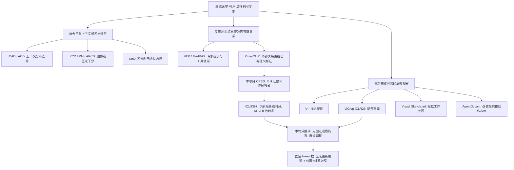

# 从 CRES 负结果出发：先验证专家有没有带来新的可用观察

基准：`02c9397852e876b2a6aaba2f1a2f9f8c60d8b2e6`。检索与实现审查：2026-09-16。

## 1. 先把研究方法改对

CS197 的项目材料要求先读最近邻、按问题/假设/洞见组织 affinity diagram，再寻找可检验的 bit flip，并优先回答最高风险的未知问题。[S0] 这不是“把旧公式减号变加号”，更不是每次失败再堆一个模块。

本图是**机制关系图**，不是已核验的论文引用网络。箭头表示概念相邻、共同问题或本项目的扩展方向；不声称后一篇论文正式引用或继承前一篇。表中“待检验前提”是我们对方法适用条件的抽象，不表示所有作者都明确提出了同一句假设。

## 2. 关系图



## 3. 最近邻与真正的区别

| 文献 | 已核实发表 | 主要做法 | 本项目需要检查的前提/边界 |
|---|---|---|---|
| CAD [S1] | NAACL 2024 | 有/无文本上下文的输出对比 | 上下文分支的差异确实包含有用信息；更服从上下文不自动更符合原图 |
| ACD [S2] | Findings EMNLP 2024 | 根据两路熵分配上下文权重 | 接收端确定性不是源证据正确率；本轮不再添加新 alpha |
| VCD [S3] | CVPR 2024 | 原图与失真图分布对比 | 扰动敏感性与实际任务收益需要区分 |
| PAI [S4] | ECCV 2024 | 增强视觉 attention、削弱文本惯性 | 已有视觉表示中需要存在可利用的信息 |
| ARCD [S5] | AAAI 2026 | 解剖 mask 的 token/attention/logit 引导 | 与医学区域引导高度相关；不能将“预测 mask + 解码”声称首次 |
| DnR [S6] | CVPR 2026 | 问题条件化视觉利用量，选择专家 refine | 有利用变化不代表所有场景都有正确性收益；不能把 CRES 的失败推广成 DnR 全部失效 |
| ProxyCLIP [S7] | ECCV 2024 | 外部 VFM 关系作为 proxy attention，汇聚 CLIP 语义内容 | 专长是空间关系，不是任意跨模型特征对齐；CRES 的均值回写也不是 ProxyCLIP 原版 |
| VEP [S8] | ACL 2025 | 小视觉模型输出符号化后提示大模型 | 语言证据是强基线，不是天然有害 |
| MedRAX [S9] | ICML 2025 | 无额外训练的医学工具循环 | 医学 Agent/插件框架已存在；本轮不重复搭框架 |
| V* [S10] | CVPR 2024 | 主动搜索局部视觉目标与高分辨率细节 | 已指出“看不清”不同于“没有注意”；完整 SEAL 组件包含训练，不能全称免训练 |
| ViCrop / MLLMs Know Where to Look [S11] | ICLR 2025 | 注意力/梯度定位后，把原图和 crop 再输入模型 | **最直接反例与强邻居**：局部重读本身不新；本轮测试固定 token 的区域回填及其匹配对照 |
| Visual Sketchpad [S12] | NeurIPS 2024 | 专家辅助创建可继续读取的视觉中间物 | 新观察接口优于只增长文本链的可能性；不等于本项目医学效果已验证 |
| AgentOccam [S13] | ICLR 2025 | 精简/对齐观察与动作空间 | 不必增加 Agent 角色才能做研究；网页结果不是医学证据 |

另外检索到 2026 年高分辨率视觉搜索/裁剪学习工作：CVSearch 作者仓库标注 ICML 2026 [S14]，GapSight 是 2026-08 预印本 [S15]。它们使“专家帮助找 crop”这个方向更拥挤；本轮不声称首次视觉重读，不把预印本/仓库标注当已独立复现的最终论文结论。

## 4. 02c9397 给出的约束，而不是事后解释

结果来自 ordered time-truncated prefix，VQA-RAD 291/451（142 图像簇）、SLAKE 350/2094（32 簇）。四小时 worker 已停，不恢复、不自动合并 PR7。[R0]

| 项 | VQA-RAD | SLAKE |
|---|---:|---:|
| compact | 53.1828 | 54.3571 |
| 删除空间文本 | 53.6295 | 55.8571 |
| native_fixed | 53.9732 | 55.8571 |
| misplaced null_fixed | 53.6295 | 55.8571 |
| CRES | 53.6295 | 55.8571 |
| CRES 每 token 最大 KL | 0.00438105 | 0.01519002 |
| CRES 平均解码秒数 | 15.0311 | 12.4893 |
| compact 平均解码秒数 | 0.6075 | 0.5565 |

CRES 与删除基线同均分，与 null_fixed 同逐例分数；CRES 与 residual_unbounded 全部 token 序列一致，不能将结果归因于 KL 保护。相对删除仍有 5/291 和 1/350 条 token 序列变化，不把“同分”写成“全部输出一样”。旧 compact 救回样本也只保留 24/30、35/51，不能声称没有损失旧收益。

这些结果没有证明“图像中缺少细节”或“所有区域方法无用”。它们只表明当前空间算子没有建立超出删除与错位对照的增益，且逐 token 多分支的成本不合算。

对应源码 `SpatialEvidenceBridge.forward` 的内容为：

```python
evidence = r @ h
assignment = regions.T * weights
result = (h + assignment @ evidence) / (1 + assignment.sum(-1, keepdim=True))
```

它重组的是已有投影特征 h。mask 本身当然可能提供额外几何信息；所以不能滥用数据处理不等式，宣称该系统“理论上不可能增加信息”。但它没有重新读取原图中被下采样压缩的局部像素。这是一个可检验的限制。[R1]

## 5. 本轮只翻一个 bit

旧的项目工作假设：**有了专家空间关系，只需重加权既有视觉表示，就能形成有用的修订方向。**

翻转后的待检验假设 H1：**在具有原生像素细节的适用样本中，专家更有价值的作用可能是指定重新编码的区域；若保持 token 数与其他证据不变，这种新观察应优于相同区域的低细节重读和相同细节的错位重读。**

这不是文献空白，ViCrop/V* 就是该翻转的最近邻。因此现阶段的贡献定位是一个受控的最小扩展和可证伪机制试验，而不是宣布已经得到 ICLR 新算法。

本轮不改 uncertainty、不增加 verifier、不扩知识库、不再训练模型、不调 KL 或疾病阈值、不增加 Agent 角色。若 H1 不成立，不通过继续增加 gate 维护它。

## 6. 唯一候选算子：区域像素重编码，固定 token 数回填

令冻结视觉编码器与已有 projector 的组合为 F，原图固定网格为 H0=F(I)。从已送达的真实预测 mask 中，按原存储顺序选择第一个满足几何条件的区域 R，不按答案、模型得分或疾病名称筛选。

候选方法：Hlocal=F(crop(I,R))，通过已知 crop/square-padding 坐标做面积对应 W_R，回到原图 token 网格：

    H' = (H0 + M_R * W_R(Hlocal)) / (1 + M_R)

只有支持区域变化；区域外逐元素保留 H0；输出 N×D 不变；不追加第二张图 token、不做双面板、不写新的 crop 描述。仍让原始 VLM 进行普通 64-token 生成。固定单位质量融合复用原算子的保守形式，不扫描强度参数。

每个候选只增加一次局部视觉编码；原图依然正常进入一次视觉 prefill 和一条有 KV 的生成轨迹。没有每 token 四分支、KL 搜索或 judge。真实延迟/显存尚未测量，不能把结构上的调用数减少当成已证明 22 倍加速。

最接近的 ViCrop 官方 `run.py` 实际使用：

```python
crop_image = image.crop(bbox)
multi_inputs = processor(multi_prompt, [image, crop_image], ...)
```

它追加局部视图；本实验不改当前 checkpoint 的单图 token 数，而做坐标对应的局部回填。[C1] 两者必须实际比较后才谈价值；不能用“不是双图输入”一句话证明新颖性或效果。

区域内 feature 的位置编码/上下文可能仍不同，面积汇聚也可能再次丢失细节。相同模型/维度不证明融合分布天然可靠。这些正是需要控制实验检验的风险。

## 7. 2×2 因子试验，不把所有提升都叫空间收益

全部候选仍读取相同原图、相同问题、相同删除空间文本后的其他证据和同样数量的视觉 token。只改变局部编码器读取的内容：

| | 真实预测区域 | 刚性平移区域 |
|---|---|---|
| 原生像素 crop | native_real（候选方法） | native_displaced |
| 全图先降到编码器分辨率再重建的 crop | low_real | low_displaced |

低细节图通过固定 bicubic 下采样→上采样生成。它是**人为像素参照**，不是 CLIP 的精确可逆 reconstruction，更不是医学真值。原图仍保留，不向最终模型直接替换成整张降质图。

控制区域保留像素尺寸、mask 数值和方向，只换窗口位置，不翻转图像；落在完整非 padding patch 以内。重合窗口、不等尺寸、全帧或没有原生分辨率优势时明确 unavailable。某个平移位置可能恰好也有有效医学信息，不将它称为负样本真值。记录 box IoU、放大比例和 native/low 像素差。

总共七臂：compact、deletion、identity 和上述四格。identity 用零 mask 的同 hook 重生成，必须逐 token 等于 deletion，否则停止。compact 保留全部已有效语义，是不可丢的主基线；四格以 deletion 为共同基准，隔离移除空间文本带来的收益。

主要配对量：

    detail_real = score(native_real) - score(low_real)
    detail_displaced = score(native_displaced) - score(low_displaced)
    interaction = detail_real - detail_displaced

还必须报告 native_real 相对 deletion、compact、native_displaced 的改善/伤害和成本。**interaction 为正不能单独证明有效**，例如两格控制都严重退化也可能让它变大。没有超过强删除基线，就不能归功于新观察。

## 8. 执行和停止条件

只启用当前 LLaVA-Med 固定方形 patch 网格；任意 Qwen 动态网格、CT/MRI 体数据、未知坐标均不偷偷兼容。模板使用现有统一短答协议，不按 CE/OE 修改输入；参考仅在离线评分读取。

新 runner 必须使用完整官方 TRAIN 清单和完整源缓存，保持 routing donor、图像及旧证据 binding。默认每次最多两个新病例和 600 秒的病例间协作停止，不自动放量。时间限制不是强制终止正在执行的 GPU kernel；可在外层加 timeout，残留失败/中断成本不可伪装成零。max-cases 不创建新数据划分。

先确认真正适用的病例完成四格真实视觉编码和非空回答，不以全 fallback 验收。只读预检和未验证权重不能叫医学测试。后续需要数据独立性、专家训练重叠及图像聚类检查；已读过的 02c9397 测试前缀不能再称未见开发集。

如果 native_real 不优于 low_real：没有新细节贡献证据。若不优于 native_displaced：没有区域对应价值证据。若全部不优于 deletion：保留旧方法并停止扩展。没有细节、错误 mask、属性不依赖区域均可能解释零收益；不能把有限覆盖下的失败无限推广。

## 9. 完成状态与论文定位

实现了候选算子、冻结模型接入、来源检查、固定预算 TRAIN runner、七臂配对 evaluator 和合成测试。未运行真实医学权重，未建立临床改善、速度提升或安全保证。旧 CRES/semantic/compact 源文件不修改，旧分支不合并，PR7 不触碰。

潜在论文故事是“专家是信息获取器，不只是分布放大器”，但其普遍形式已有 V*/ViCrop/Sketchpad。要达到新的论文贡献，必须证明固定 token 区域回填、严格匹配对照和跨专家结果带来已有强方法不能解释的新认识。不能把本次工程测试、代码量或 bit-flip 命名当成录用保证。

## References / audited code

[S0] Stanford CS197 project, affinity diagrams / assumptions / bit flips / vectoring: https://web.stanford.edu/class/cs197/assignments/project.html
[S1] CAD, NAACL 2024: https://aclanthology.org/2024.naacl-short.69/
[S2] ACD, Findings EMNLP 2024: https://aclanthology.org/2024.findings-emnlp.136/
[S3] VCD, CVPR 2024: https://openaccess.thecvf.com/content/CVPR2024/html/Leng_Mitigating_Object_Hallucinations_in_Large_Vision-Language_Models_through_Visual_Contrastive_CVPR_2024_paper.html
[S4] PAI, ECCV 2024: https://www.ecva.net/papers/eccv_2024/papers_ECCV/html/10933_ECCV_2024_paper.php
[S5] ARCD, AAAI 2026: https://ojs.aaai.org/index.php/AAAI/article/view/37620
[S6] DnR, CVPR 2026: https://openaccess.thecvf.com/content/CVPR2026/html/Jeong_Draft_and_Refine_with_Visual_Experts_CVPR_2026_paper.html
[S7] ProxyCLIP, ECCV 2024: https://www.ecva.net/papers/eccv_2024/papers_ECCV/html/8490_ECCV_2024_paper.php
[S8] VEP, ACL 2025: https://aclanthology.org/2025.acl-long.205/
[S9] MedRAX, ICML 2025: https://proceedings.mlr.press/v267/fallahpour25a.html
[S10] V*, CVPR 2024: https://openaccess.thecvf.com/content/CVPR2024/html/Wu_V_Guided_Visual_Search_as_a_Core_Mechanism_in_Multimodal_CVPR_2024_paper.html
[S11] ViCrop, ICLR 2025: https://proceedings.iclr.cc/paper_files/paper/2025/hash/aaa0ac4253da75faf9b0dc0dda062612-Abstract-Conference.html
[S12] Visual Sketchpad, NeurIPS 2024: https://papers.neurips.cc/paper_files/paper/2024/hash/fb82011040977c7712409fbdb5456647-Abstract-Conference.html
[S13] AgentOccam, ICLR 2025: https://proceedings.iclr.cc/paper_files/paper/2025/hash/f2c6e459b95694a24ac69c469a4ee746-Abstract-Conference.html
[S14] CVSearch author repository, venue claim not independently checked against final proceedings here: https://github.com/liliupeng28/ICML26-CVSearch
[S15] GapSight preprint: https://arxiv.org/abs/2608.21762
[C1] ViCrop actual crop/multi-image code, inspected blob d2ebc705b0112716769ee6c3d8cf052a580d5db8: https://github.com/saccharomycetes/mllms_know/blob/main/run.py
[C2] ViCrop internal localization, inspected blob df2670a630e63dfcaaf1bd53a2ded0f540012192: https://github.com/saccharomycetes/mllms_know/blob/main/llava_methods.py
[R0] Frozen result: https://github.com/dfdu233/merit-feddg/blob/02c9397852e876b2a6aaba2f1a2f9f8c60d8b2e6/docs/results/cres-four-hour/README.md
[R1] Frozen operator: https://github.com/dfdu233/merit-feddg/blob/02c9397852e876b2a6aaba2f1a2f9f8c60d8b2e6/merit_feddg/spatial_evidence.py
[R2] CRES exact controls and KL: https://github.com/dfdu233/merit-feddg/blob/02c9397852e876b2a6aaba2f1a2f9f8c60d8b2e6/merit_feddg/control_evidence.py
